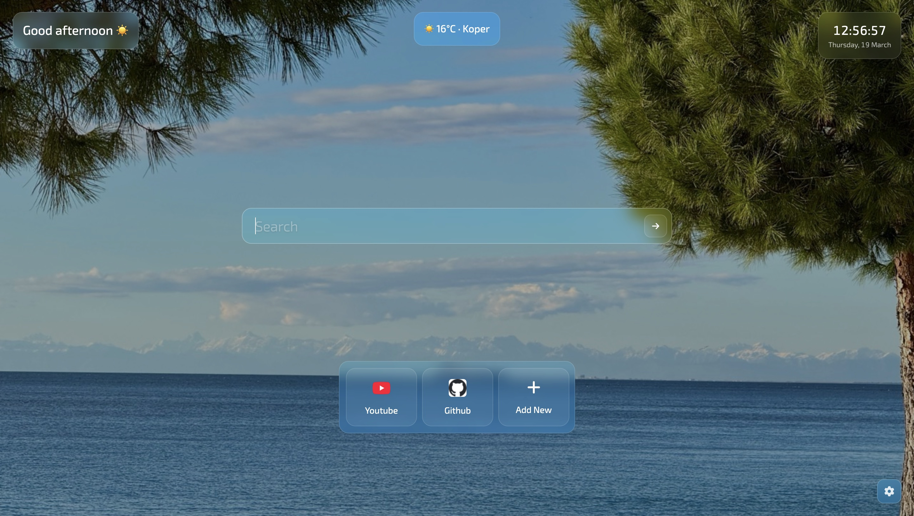

  

> *Clear sky, clear mind.*

A minimalistic frosted-glass new tab extension. Replaces your browser's default new tab with something you actually want to look at.

---

## Install

### Firefox
[Get it on Firefox Add-ons](https://addons.mozilla.org/en-US/firefox/addon/vedro/)

### Chrome / Edge / Brave
Coming soon to the Chrome Web Store. Until then:
1. [Download the repository](https://github.com/stralej/start-page/archive/refs/heads/main.zip) and unzip it
2. Go to `chrome://extensions` (or `edge://extensions` / `brave://extensions`)
3. Enable **Developer mode** in the top right corner
4. Click **Load unpacked**
5. Select the unzipped project folder

The extension will stay installed until you remove it manually.

---

## What's inside

### Wallpapers
Three modes, switchable from settings:
- **Random** — a fresh image from [Picsum](https://picsum.photos/) every tab
- **Vedro** — a curated pack of wallpapers included with the extension
- **My library** — your own images, stored locally in IndexedDB. Add, preview, and remove them from the settings panel

### Search
Type and hit enter. If your query has a dot and no spaces it goes directly to that URL — otherwise it searches using your chosen engine. Supports Google, DuckDuckGo, Bing, Yahoo, Yandex, and Brave Search. Press `S` or `Space` to focus the search bar from anywhere on the page.

### Favorites
Fully managed from the page — no code editing needed.
- **Add** — click the `+` tile, enter a title and URL. Favicon is fetched automatically. You can also right-click anywhere on the favorites bar to add a new one
- **Edit / Remove** — right-click any favorite
- **Reorder** — click and hold, then drag to reposition

### Weather
Shows current conditions and your city in the top center. Uses [Open-Meteo](https://open-meteo.com/) — no API key needed. Location is detected automatically. Toggle Celsius / Fahrenheit from settings.

### Clock
Displays time and date in the top right. Configurable: 12 or 24-hour format, seconds on or off. Each digit animates individually when it changes.

### Languages
Supports Български, Deutsch, English, Magyar, Slovenščina, Srpski, Српски, and Suomi. Auto-detects your browser language on first visit, remembers your choice after that.

### Appearance
Adjust the panel blur intensity from the settings slider with a smooth snapping animation. All panels share the same frosted-glass aesthetic — backdrop blur, subtle borders, soft transparency.

### Settings
Toggle individual UI elements on or off — welcome message, clock, date, seconds, weather, favorites, the add new button, and Celsius mode. All toggles animate smoothly.

---

## First launch

On your first visit, a short onboarding modal will guide you through setting Vedro as your homepage. It auto-detects your browser (Chrome, Firefox, Edge, or Brave) and shows step-by-step instructions. Dismiss it permanently or ask to be reminded next session.

---

## Secret

There's one. You'll find it.

---

## Special thanks

[drb0r1s](https://github.com/drb0r1s) for the localStorage help. ❤️

---

⭐ star it if you like it